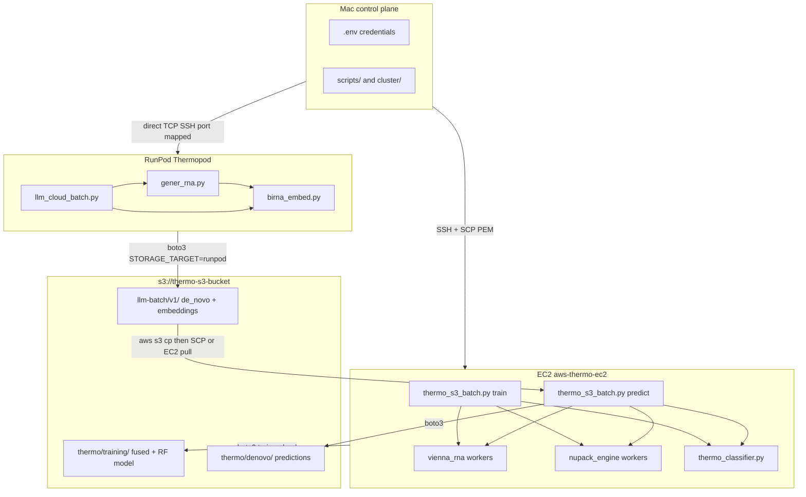

# Cloud Pipeline — Finalized Architecture

This document is the source of truth for the **hybrid RunPod + AWS** deployment of Thermoswitches-MLBIO. It covers both tracks:

1. **GenerRNA + BiRNA-BERT** on RunPod Thermopod (GPU), artifacts to S3  
2. **ViennaRNA + NUPACK + Random Forest** on EC2 `aws-thermo-ec2` (CPU), training/prediction artifacts to S3  

It records every finalized connection choice, script, and adjustment made during rollout.

---

## 1. High-level design



### Execution order (memory-safe)

| Step | Machine | Job |
|------|---------|-----|
| 1 | **RunPod Thermopod** | GenerRNA 10,000 sequences → BiRNA NUC embeddings → upload to S3 → terminate pod |
| 2 | **EC2** (parallel with Step 1) | Vienna + NUPACK on **2,396** balanced sequences → `fused_features.csv` → train Random Forest → upload to S3 → **stop instance** |
| 3 | **EC2** (second session) | Pull 10k `generated.fasta` from S3 → same thermo pipeline → RF predict → upload predictions → stop |

Steps 1 and 2 run in parallel. Step 3 waits for both Step 1 (FASTA on S3) and Step 2 (trained model).

---

## 2. Shared storage: AWS S3

| Setting | Final value |
|---------|-------------|
| Bucket | `thermo-s3-bucket` |
| Region | `us-east-1` |
| IAM user | `Arcblanc` (group **arc** — full access granted for Put/Get/List) |
| LLM prefix | `llm-batch/v1` (`AWS_S3_PREFIX`) |
| Thermo training prefix | `thermo/training/` |
| Thermo de novo prefix | `thermo/denovo/` |

### Object layout

```
s3://thermo-s3-bucket/
  llm-batch/v1/                          # RunPod LLM track
    de_novo/generated.fasta
    de_novo/generation_manifest.jsonl
    validation_embedding/manifest.jsonl
    validation_embedding/sample_*.npy
    validation_embedding/sample_*.json
    run_state.json
  thermo/training/                       # EC2 train track
    fused_features.csv
    viennarna/features.csv
    nupack/features.csv
    models/rf_thermoswitch.joblib
  thermo/denovo/                         # EC2 predict track
    fused_features.csv
    predictions.csv
    viennarna/features.csv
    nupack/features.csv
```

### Storage backend code

- Module: [`src/validation_embedding/storage.py`](../src/validation_embedding/storage.py)
- Config: [`src/validation_embedding/config.py`](../src/validation_embedding/config.py)
- `STORAGE_TARGET` values:
  - `local` — no remote I/O
  - `gcs` — legacy GCP Spot path (still supported)
  - `s3` — boto3 to `AWS_S3_BUCKET` / `AWS_S3_PREFIX`
  - `runpod` — same as `s3` for uploads, plus RunPod terminate API when `RUNPOD_AUTO_TERMINATE=true`

**Finalized storage adjustments:**

| Adjustment | Why |
|------------|-----|
| Migrated from GCS-only to **S3 + runpod** targets | GCP A100 quota blocked; AWS + RunPod chosen |
| `upload_file` returns `bool` and **warns on failure** instead of crashing | Early IAM `AccessDenied` aborted the whole batch |
| `_list_remote_objects` **ignores ListBucket AccessDenied** | Fresh runs can start without listing embeddings |
| Thermo training/predict uploads use **dedicated keys** under `thermo/` (not LLM prefix) | Clear separation of LLM vs physics artifacts |

Deps: [`requirements-aws.txt`](../requirements-aws.txt) (`boto3` only).

---

## 3. Track A — GenerRNA + BiRNA-BERT (RunPod)

### 3.1 Hardware and image (final)

| Spec | Value |
|------|--------|
| Pod name | Thermopod |
| Pod ID | `x0ggh3d7lmi9yn` (API id; SSH user may include a suffix) |
| GPU | 1× NVIDIA A100 80GB PCIe |
| RAM / vCPU | 117 GB / 12–31 vCPU (template-dependent) |
| Disk | ~106 GB container + network volume at `/workspace` |
| Image | `runpod/pytorch:1.0.2-cu1281-torch280-ubuntu2404` |
| Native PyTorch | **2.8.0+cu128** (must not be overwritten by pip) |

### 3.2 Connection model (final)

RunPod’s **SSH proxy does not support SCP/SFTP**.

| Path | How |
|------|-----|
| **Preferred SSH** | Direct TCP: `ssh -p <mapped_port> -i ~/.ssh/id_ed25519 root@<publicIp>` |
| Port / IP | From RunPod API: `portMappings["22"]`, `publicIp` (e.g. `38.128.233.132:42225`) |
| Proxy (often fails if `PUBLIC_KEY` mis-set) | `ssh x0ggh3d7lmi9yn-64410a9d@ssh.runpod.io -i ~/.ssh/id_ed25519` |
| Helper | [`scripts/runpod_ssh.sh`](../scripts/runpod_ssh.sh) (proxy form from `.env`) |
| File ingress | `git clone` / `git pull` **inside** the pod, or direct-TCP `scp -P <port>` (works on direct TCP; not on proxy) |
| File egress | **boto3 → S3 only** for production artifacts |

**Finalized SSH adjustments:**

| Adjustment | Why |
|------------|-----|
| Pod `PUBLIC_KEY` must be the **full** `ssh-ed25519 AAAA...` line, not the SHA256 fingerprint | Fingerprint-only env caused `Permission denied (publickey)` |
| Prefer **direct TCP SSH** over `ssh.runpod.io` | Proxy auth was unreliable; direct port mapping works with the same key |
| Pod stop/start after key patch | Applies `PUBLIC_KEY` into authorized_keys |

### 3.3 Pipeline scripts

| Script | Role |
|--------|------|
| [`scripts/llm_cloud_batch.py`](../scripts/llm_cloud_batch.py) | Orchestrator: `sync_down` → GenerRNA → BiRNA → verify → `sync_up` → optional RunPod terminate |
| [`scripts/llm_cloud_run.sh`](../scripts/llm_cloud_run.sh) | Thin wrapper activating venv and calling `llm_cloud_batch.py` |
| [`cluster/runpod_thermopod.sh`](runpod_thermopod.sh) | Bootstrap: system-site-packages venv, install LLM+AWS deps **without torch**, CUDA check, then batch |
| [`cluster/runpod_full_batch.sh`](runpod_full_batch.sh) | Non-interactive full-batch launcher template |
| [`src/de_novo_hallucinations/gener_rna.py`](../src/de_novo_hallucinations/gener_rna.py) | GenerRNA generation, resume, manifest, S3 flush |
| [`src/validation_embedding/birna_embed.py`](../src/validation_embedding/birna_embed.py) | BiRNA-BERT NUC embeddings (`.npy` + `.json` + manifest) |
| [`scripts/verify_llm_smoke_outputs.py`](../scripts/verify_llm_smoke_outputs.py) | Validates FASTA + embedding counts |

### 3.4 GenerRNA finalized behavior

| Setting | Value |
|---------|--------|
| Samples | `GENERNA_NUM_SAMPLES=10000` |
| Batch size | `GENERNA_BATCH_SIZE=50` |
| Output FASTA | `data/processed/de_novo/generated.fasta` |
| Manifest | `data/processed/de_novo/generation_manifest.jsonl` |
| Resume | `--resume` skips completed `record_id`s; continues from next `sample_N` |
| Checkpoint | After each batch: write `run_state.json`, `sync_up` to S3 |
| SIGTERM | Flush artifacts then exit 143 (preemption-safe pattern) |

**Finalized GenerRNA adjustments:**

| Adjustment | Why |
|------------|-----|
| **Skip invalid sequences** (e.g. bases containing `N`) instead of raising | Mid-batch crash at ~48 sequences aborted the full run |
| Only count **accepted** sequences toward `remaining` | Invalid draws must not consume sample budget incorrectly |
| Device-agnostic tensors (`device=device`) | Allows CPU fallback on Mac; on RunPod must still see CUDA |

### 3.5 BiRNA-BERT finalized behavior

| Setting | Value |
|---------|--------|
| Tokenizer / model | `buetnlpbio/birna-tokenizer`, `buetnlpbio/birna-bert` |
| Tokenization | Nucleotide-level (NUC) |
| Outputs | `data/processed/validation_embedding/sample_*.npy`, `sample_*.json`, `manifest.jsonl` |
| Resume | Skip `record_id`s already in embedding manifest |

### 3.6 PyTorch / CUDA (critical finalized choice)

**Do not `pip install torch` on RunPod.**

| Choice | Detail |
|--------|--------|
| [`requirements-llm.txt`](../requirements-llm.txt) | **No `torch` line** — only transformers, huggingface_hub, einops, accelerate, dotenv, GCS client, etc. |
| Venv | `python3 -m venv --system-site-packages .venv` so the image’s CUDA-matched PyTorch is visible |
| Guard | [`cluster/runpod_thermopod.sh`](runpod_thermopod.sh) aborts if `torch.cuda.is_available()` is false |
| Local Mac | Install torch separately: `pip install torch>=2.1 && pip install -r requirements-llm.txt` |

**Root cause fixed:** pip’s generic torch wheel overwrote `2.8.0+cu128`, producing “NVIDIA driver too old” and silent **CPU fallback** via the Mac-oriented device selection path.

### 3.7 RunPod terminate

- `RUNPOD_AUTO_TERMINATE=true`
- `RUNPOD_POD_ID=x0ggh3d7lmi9yn` (API id, not the SSH username suffix form)
- `llm_cloud_batch.py` → `runpod_terminate_if_configured()` posts stop to RunPod REST API after successful verify + final `sync_up`

### 3.8 RunPod launch commands (final)

Inside pod (after `.env` with AWS keys + `STORAGE_TARGET=runpod`):

```bash
cd /workspace/Thermoswitches-MLBIO
bash cluster/runpod_thermopod.sh --yes
# or:
export GENERNA_NUM_SAMPLES=10000 GENERNA_BATCH_SIZE=50
python scripts/llm_cloud_batch.py
```

From Mac (direct TCP example):

```bash
# Discover port/IP via RunPod API, then:
scp -P $PORT -i ~/.ssh/id_ed25519 .env root@$IP:/workspace/thermo.env
ssh -p $PORT -i ~/.ssh/id_ed25519 root@$IP
```

Log on pod: `/workspace/full_10k.log`

---

## 4. Track B — ViennaRNA + NUPACK + Random Forest (EC2)

### 4.1 Hardware (final)

| Spec | Value |
|------|--------|
| Name | `aws-thermo-ec2` |
| Instance ID | `i-0123fbf60559bd082` |
| Public IP | `35.179.95.63` (ephemeral; refresh if stopped/started) |
| Type | **`c7i-flex.large`** — 2 vCPU, ~3.7 GiB RAM |
| User | `ubuntu` |
| Key | `/Users/amierzuhri/Downloads/Thermo-bio-key.pem` (`chmod 400`) |
| Region | `eu-west-2` (instance AZ; S3 API still uses `AWS_REGION=us-east-1` for the bucket) |

### 4.2 Connection model (final)

| Path | How |
|------|-----|
| SSH | `ssh -i /Users/amierzuhri/Downloads/Thermo-bio-key.pem ubuntu@35.179.95.63` |
| SCP | Supported (standard OpenSSH) — used to rsync repo, balanced data, NUPACK wheels |
| Mac helpers | [`scripts/scp_ec2.sh`](../scripts/scp_ec2.sh), [`scripts/thermo_ec2_run.sh`](../scripts/thermo_ec2_run.sh) |
| Artifact egress | **boto3 → S3** via `thermo_s3_batch.py` (finalized; not SCP-only) |
| Shutdown | `EC2_AUTO_SHUTDOWN=true` → `boto3.client("ec2").stop_instances` |

**Finalized EC2 transfer adjustment:** Early plan used SCP-only for thermo results. Final design **uploads training and prediction artifacts to S3** and **stops the instance** so billing stops without a Mac pull step. SCP remains available for bootstrap and emergency recovery.

### 4.3 Python environment (final)

Ubuntu on this AMI ships **Python 3.14**, but NUPACK 4.1.0.1 only provides Linux wheels through **cp312**.

| Choice | Detail |
|--------|--------|
| Runtime | **micromamba** env `thermo` with **Python 3.12.13** |
| Install | Linux micromamba binary (not the Mac `bin/micromamba` in the repo — wrong arch) |
| NUPACK wheel | `nupack-4.1.0.1-cp312-cp312-linux_x86_64.whl` |
| ViennaRNA | `pip install viennarna` |
| Other | `requirements.txt` + `requirements-aws.txt` + `joblib` |

Activate on EC2:

```bash
export PATH="$HOME/bin:$PATH"
export MAMBA_ROOT_PREFIX="$HOME/micromamba"
eval "$(micromamba shell hook -s bash)"
micromamba activate thermo
```

### 4.4 Physics features (finalized columns)

Core features requested for thermoswitch classification:

| Feature | Columns |
|---------|---------|
| MFE | `nupack_MFE`, `viennarna_MFE` |
| Stem length | `nupack_max_stem_length` |
| Loop size | `nupack_max_loop_length`, `viennarna_max_loop_length` |
| Melting / unpaired proxies | `viennarna_mean_unpaired_prob`, `nupack_mean_exposure`, Tm, Hill, amplitude, SD pair probs |
| GC content | `nupack_gc_content`, `viennarna_gc_content` |

Implemented in:

- [`src/thermo_sim/thermo_common.py`](../src/thermo_sim/thermo_common.py) — `gc_content()`, `max_loop_length()`, `load_fasta_dataset()`
- [`src/thermo_sim/vienna_rna.py`](../src/thermo_sim/vienna_rna.py)
- [`src/thermo_sim/nupack_engine.py`](../src/thermo_sim/nupack_engine.py)
- [`src/thermo_sim/feature_fusion.py`](../src/thermo_sim/feature_fusion.py)

### 4.5 Thermo batch modes

[`src/thermo_sim/thermo_batch.py`](../src/thermo_sim/thermo_batch.py):

| Mode | Input | Join key | Use |
|------|-------|----------|-----|
| `balanced` | `balanced_dataset.csv` + `.fasta` | Rfam `(rfamseq_acc, seq_start, seq_end)` | Train (2,396 labeled) |
| `fasta` | `generated.fasta` only | `record_id` (`sample_N`) | Predict (10k de novo) |

**Memory-safe defaults for `c7i-flex.large`:**

```text
--run --resume --workers 2 --batch-size 1 --limit 2396   # train
--run --resume --workers 2 --batch-size 1 --limit 10000  # predict
```

`--batch-size 1` avoids OOM; `--resume` continues from existing `fused_features.csv` keys.

### 4.6 Random Forest

[`src/thermo_sim/thermo_classifier.py`](../src/thermo_sim/thermo_classifier.py):

| Phase | Input | Output |
|-------|-------|--------|
| `train` | labeled `fused_features.csv` | `data/processed/models/rf_thermoswitch.joblib` |
| `predict` | de novo fused features + model | `data/processed/denovo_predictions.csv` (`record_id`, `prob_positive`, `predicted_label`) |

Physics feature set used for training is the MFE / stem / loop / unpaired / GC / Tm / Hill block listed above (columns present in the fused CSV).

### 4.7 Orchestrator scripts

| Script | Role |
|--------|------|
| [`scripts/thermo_s3_batch.py`](../scripts/thermo_s3_batch.py) | **Primary:** `train` / `predict`, S3 upload, EC2 stop |
| [`scripts/thermo_ec2_batch.py`](../scripts/thermo_ec2_batch.py) | Earlier local-only orchestrator (no S3/stop); superseded for cloud runs |
| [`scripts/thermo_ec2_run.sh`](../scripts/thermo_ec2_run.sh) | SSH wrapper → `thermo_s3_batch.py` |
| [`scripts/scp_ec2.sh`](../scripts/scp_ec2.sh) | SCP push/pull helpers (FASTA, model, results) |
| [`cluster/ec2_bootstrap_thermo.sh`](ec2_bootstrap_thermo.sh) | Apt/venv bootstrap (use micromamba path on this AMI) |

### 4.8 Train command (Step 2 — finalized)

On EC2:

```bash
cd ~/Thermoswitches-MLBIO
micromamba activate thermo
export STORAGE_TARGET=s3 EC2_AUTO_SHUTDOWN=true
nohup python scripts/thermo_s3_batch.py train \
  --run --resume --workers 2 --batch-size 1 --limit 2396 \
  > /home/ubuntu/thermo_train.log 2>&1 &
```

Automatic sequence:

1. ViennaRNA + NUPACK on all 2,396 balanced sequences  
2. Append to `data/processed/fused_features.csv`  
3. `train_random_forest` → `rf_thermoswitch.joblib`  
4. Upload to `s3://thermo-s3-bucket/thermo/training/`  
5. `stop_instances(i-0123fbf60559bd082)`  

Progress signals: `data/processed/batch_ram_log.jsonl`, row count of `fused_features.csv`.

### 4.9 Predict command (Step 3 — after RunPod completes)

```bash
# On Mac or EC2: ensure generated.fasta is present
aws s3 cp s3://thermo-s3-bucket/llm-batch/v1/de_novo/generated.fasta \
  data/processed/de_novo/generated.fasta
# If Mac: bash scripts/scp_ec2.sh push-fasta

python scripts/thermo_s3_batch.py predict \
  --run --resume --workers 2 --batch-size 1 --limit 10000
```

Uploads predictions to `s3://thermo-s3-bucket/thermo/denovo/` and stops EC2.

---

## 5. Environment variables (final map)

See [`.env.example`](../.env.example). Critical keys:

| Variable | Track | Purpose |
|----------|-------|---------|
| `STORAGE_TARGET` | Both | `runpod` on pod; `s3` on EC2 |
| `AWS_S3_BUCKET` / `AWS_REGION` / `AWS_S3_PREFIX` | Both | Bucket + LLM prefix |
| `AWS_ACCESS_KEY_ID` / `AWS_SECRET_ACCESS_KEY` | Both | IAM `Arcblanc` |
| `GENERNA_NUM_SAMPLES` / `GENERNA_BATCH_SIZE` | RunPod | 10000 / 50 |
| `RUNPOD_POD_ID` / `RUNPOD_API_KEY` / `RUNPOD_AUTO_TERMINATE` | RunPod | Stop pod after success |
| `RUNPOD_SSH_*` | Mac | Proxy SSH helper |
| `EC2_HOST` / `EC2_INSTANCE_ID` / `EC2_SSH_KEY` | Mac + EC2 stop | Access and shutdown |
| `EC2_AUTO_SHUTDOWN` | EC2 | Stop after train/predict |
| `HF_TOKEN` | RunPod | Optional faster HF downloads |

---

## 6. Master list of finalized adjustments

### Platform

1. Abandoned GCP Spot A100 path as primary (quota / preemption); kept GCS code as legacy.  
2. Primary GPU: **RunPod Thermopod A100**.  
3. Primary CPU thermo: **EC2 `c7i-flex.large`**.  
4. Primary object store: **`s3://thermo-s3-bucket`**.

### RunPod / LLM

5. `STORAGE_TARGET=runpod` uses S3 under the hood.  
6. No SCP on RunPod proxy; prefer direct TCP SSH.  
7. Full SSH public key in pod `PUBLIC_KEY` env (not fingerprint).  
8. **Never pip-install torch** on the pytorch template; use `--system-site-packages`.  
9. CUDA preflight in `runpod_thermopod.sh`.  
10. GenerRNA skips invalid alphabets (`N`, etc.) and keeps generating until target count.  
11. Resume + per-batch S3 checkpoint.  
12. Soft-fail S3 upload warnings so generation is not blocked by transient IAM issues (IAM later fixed via group **arc**).  
13. Auto-terminate pod via RunPod API after successful batch.

### EC2 / thermo

14. Memory-safe flags: `--workers 2 --batch-size 1`.  
15. Two separate jobs: train (2396) then predict (10000).  
16. FASTA-only mode with `record_id` join for de novo.  
17. Added GC, loop length, Vienna MFE to feature set.  
18. `thermo_s3_batch.py` uploads fused features + model/predictions to S3.  
19. Auto-stop EC2 after successful train/predict.  
20. Python **3.12 via micromamba** (not system 3.14) for NUPACK wheel ABI.  
21. Balanced dataset + NUPACK wheels rsynced from Mac (gitignored assets).

### IAM

22. User `Arcblanc` requires `s3:PutObject`, `s3:GetObject`, `s3:ListBucket` on `thermo-s3-bucket`.  
23. EC2 stop requires `ec2:StopInstances` on `i-0123fbf60559bd082` (group **arc** full access used in practice).

---

## 7. Operational monitoring

### RunPod 10k

```bash
# S3 progress
aws s3 cp s3://thermo-s3-bucket/llm-batch/v1/run_state.json -
wc -l <(aws s3 cp s3://thermo-s3-bucket/llm-batch/v1/de_novo/generation_manifest.jsonl -)

# Live pod (direct SSH)
ssh -p $PORT -i ~/.ssh/id_ed25519 root@$IP \
  'cat /workspace/Thermoswitches-MLBIO/data/processed/run_state.json; \
   wc -l /workspace/Thermoswitches-MLBIO/data/processed/de_novo/generation_manifest.jsonl'
```

### EC2 train

```bash
ssh -i /Users/amierzuhri/Downloads/Thermo-bio-key.pem ubuntu@35.179.95.63 \
  'pgrep -af thermo_s3_batch; wc -l ~/Thermoswitches-MLBIO/data/processed/fused_features.csv; \
   tail -1 ~/Thermoswitches-MLBIO/data/processed/batch_ram_log.jsonl'
```

### Expected throughputs (observed)

| Job | Rate | Notes |
|-----|------|-------|
| GenerRNA on A100 | ~170 sequences/min | batch size 50 |
| Thermo on c7i-flex.large | ~1–3 s/sequence | batch size 1, both engines |

---

## 8. Related docs

| Doc | Scope |
|-----|--------|
| [README-aws.md](README-aws.md) | Operator runbook (commands) |
| [README.md](README.md) (GCP section) | Legacy Spot VM path |
| [cluster/README.md](README.md) | Original GCP Spot notes |

This file (`CLOUD_PIPELINE.md`) supersedes informal chat plans for **finalized** cloud choices.
